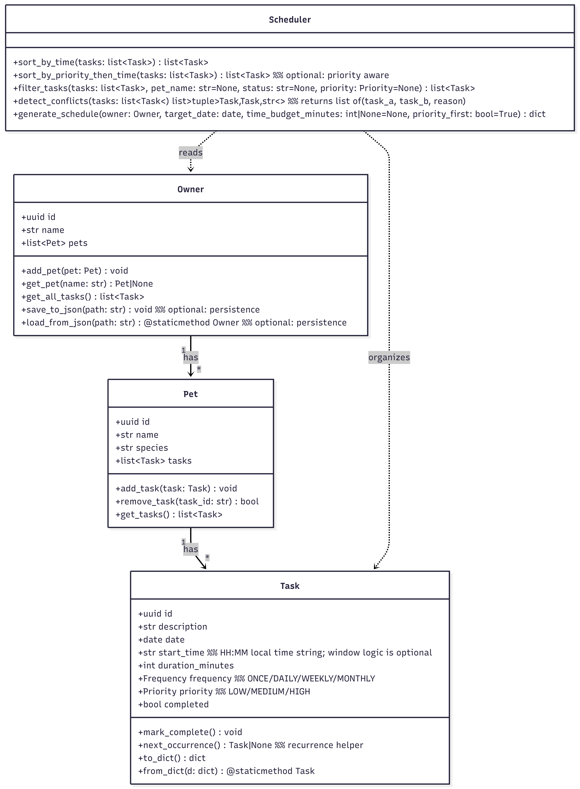
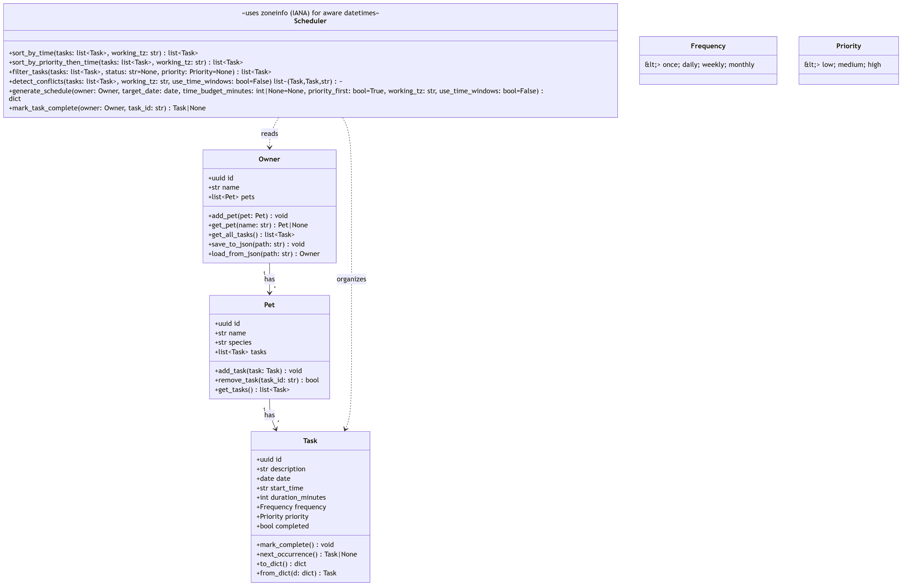
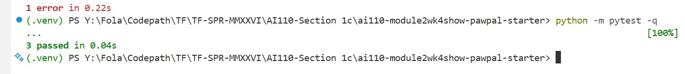
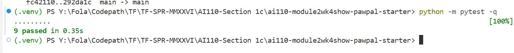
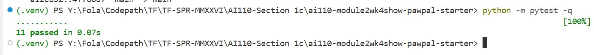
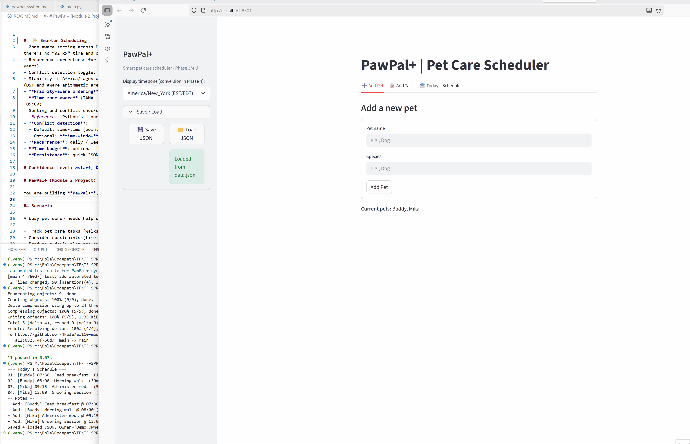
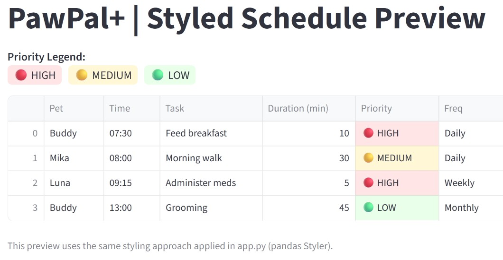

## ✨ UMLs: Original and Final ✨




## ✨ Smarter Scheduling
- Zone‑aware sorting across DST changeovers in America/New_York (we use Mar 8, 2026, the spring‑forward date) so there’s no “02:xx” time and ordering is consistent; also checks the offset change (EST→EDT).
- Recurrence correctness for daily, weekly, and monthly (including end‑of‑month clamping, both non‑leap and leap years).
- Conflict detection toggle: no conflict in default same‑time mode, does flag overlap in time‑window mode.
- Stability in Africa/Lagos and Asia/Karachi (no DST in either), verifying simple chronological order is preserved. (DST and aware arithmetic are handled by zoneinfo’s IANA database.)
- **Priority-aware ordering**: HIGH → MEDIUM → LOW, then HH:MM.
- **Time‑zone aware** (IANA `zoneinfo`): choose your working/display zone (America/New_York, Africa/Lagos, UTC+05:00).  
  Sorting and conflict checks use **aware datetimes** so DST rules are correct automatically.  
  _Reference:_ Python's `zoneinfo` (PEP 615) and IANA database.  
- **Conflict detection**:
  - Default: same‑time (point‑in‑time) collision.
  - Optional: **time‑window** overlap using `start_time + duration_minutes` (toggle in UI).
- **Recurrence**: daily / weekly / monthly; completing a task auto-creates the next occurrence.
- **Time budget**: optional total minutes cap; tasks that don't fit are skipped with explanation.
- **Persistence**: quick JSON save/load (`data.json`) for demos.

# Confidence Level: &starf; &starf; &starf; &starf; &starf;

### 🧪 Tests

**Final Demo**:


**Phase 2**:



**Phase 4 & 5**:



**Phase V**:



**App run CLI & Web UI**:



**Table Preview**:



### 🔐 Security notes
- No secrets in code or JSON. If / when I later add APIs or login, will store credentials with `st.secrets` / `secrets.toml`.
- Streamlit state (`st.session_state`) is per‑session only and resets on server restart.
- Streamlit session state is per session; persistent data is `data.json` (auto‑loaded on app start).

## 🧭 Optional Extensions (as requested)

### A) Priority colouring **with full legend** (in addition to badges)

### 🔐 Reference / Works cited:
- [PawPal+ Repo](https://github.com/codepath/ai110-module2show-pawpal-starter)
- [Python zoneinfo docs](https://github.com/pganssle/zoneinfo)
- [TimeAndDate – New York 2026 DST](https://www.timeanddate.com/time/zone/usa/new-york-state)
# -------------------------------
# 
#
#
#
#
#
# -------------------------------


# PawPal+ (Module 2 Project)

You are building **PawPal+**, a Streamlit app that helps a pet owner plan care tasks for their pet.

## Scenario

A busy pet owner needs help staying consistent with pet care. They want an assistant that can:

- Track pet care tasks (walks, feeding, meds, enrichment, grooming, etc.)
- Consider constraints (time available, priority, owner preferences)
- Produce a daily plan and explain why it chose that plan

Your job is to design the system first (UML), then implement the logic in Python, then connect it to the Streamlit UI.

## What you will build

Your final app should:

- Let a user enter basic owner + pet info
- Let a user add/edit tasks (duration + priority at minimum)
- Generate a daily schedule/plan based on constraints and priorities
- Display the plan clearly (and ideally explain the reasoning)
- Include tests for the most important scheduling behaviors

## Getting started

### Setup

```bash
python -m venv .venv
source .venv/bin/activate  # Windows: .venv\Scripts\activate
pip install -r requirements.txt
```

### Suggested workflow

1. Read the scenario carefully and identify requirements and edge cases.
2. Draft a UML diagram (classes, attributes, methods, relationships).
3. Convert UML into Python class stubs (no logic yet).
4. Implement scheduling logic in small increments.
5. Add tests to verify key behaviors.
6. Connect your logic to the Streamlit UI in `app.py`.
7. Refine UML so it matches what you actually built.
